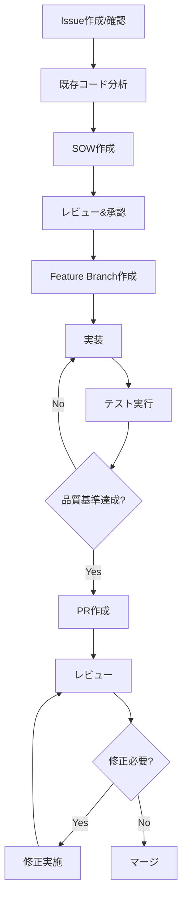

# 開発プロセスガイドライン for Claude Opus

## 🎯 目的
このドキュメントは、Claude Opusが開発タスクを実行する際の標準的なワークフローと品質基準を定義します。

## 📋 必須ルール（全てのタスクで遵守すること）

### 1. Issue駆動開発の実施
- **要求**: 全ての作業はGitHub Issueベースで管理すること
- **アクション**: ghコマンドを使うこと。
  - Issueを作成または参照して作業を開始。PRではないので注意。
  - master ブランチにまず移動したうえで、fetch&pullで最新化。
  - master ブランチから Feature ブランチを作成（命名規則: `feature/issue-{番号}-{簡潔な説明}`）
  - 実装はこのブランチ上で行う

### 2. SOW（作業範囲書）の作成
- **要求**: 実装開始前に必ずSOWを作成すること
- **重要**: SOW作成時は必ずWeb検索を使用して最新のベストプラクティスや実装方法を詳細にリサーチすること（自分の知識だけで実装しない）
- **SOWに含めるべき項目**:
  ```markdown
  ## 作業範囲書（SOW）
  
  ### 1. 作業概要
  - Issue番号: #XX
  - 目的: [なぜこの変更が必要か]
  - スコープ: [何を変更するか]
  
  ### 2. 既存コード分析
  - 影響を受けるファイル: [ファイルリスト]
  - 現在の実装の仕組み: [既存コードの動作説明]
  - 依存関係: [関連するモジュール/機能]
  
  ### 3. リスク評価
  - デグレードの可能性: [High/Medium/Low]
  - 影響範囲: [影響を受ける機能のリスト]
  - 軽減策: [リスクを最小化する方法]
  
  ### 4. 設計思想
  - アーキテクチャ: [採用するパターン/アプローチ]
  - 保守性: [将来の変更への対応方法]
  - ベストプラクティス: [適用する業界標準]
  - リサーチ結果: [Web検索で調査した最新の実装方法/参考資料]
  
  ### 5. 受け入れ基準
  - [ ] 機能要件1
  - [ ] 機能要件2
  - [ ] 非機能要件（パフォーマンス、セキュリティ等）
  - [ ] テストケース
  ```

### 3. 実装前の既存コード確認
- **必須アクション**:
  1. 関連する全てのファイルを読み込む（`read_file`ツールを使用）
  2. コードベース全体を検索して影響範囲を特定（`codebase_search`、`grep`ツールを使用）
  3. 依存関係とインターフェースを完全に理解する
  4. 既存のテストケースを確認する

### 4. 品質保証プロセス
- **実装完了前のチェックリスト**:
  - ✅ 全ての受け入れ基準を満たしている
  - ✅ ユニットテストが成功している
  - ✅ ビルドが正常に完了している（`npm run build`等）
  - ✅ リンターエラーがない（`read_lints`ツールで確認）
  - ✅ 最新のベストプラクティスに準拠している
  - ✅ ドキュメントが更新されている

### 5. Pull Request作成
- **PRに含めるべき情報**:
  ```markdown
  ## PR概要
  - Closes #[Issue番号]
  
  ## 変更内容
  - [主要な変更点のサマリー]
  
  ## テスト結果
  - [実行したテストと結果]
  
  ## チェックリスト
  - [ ] SOWの全項目を満たしている
  - [ ] テストが全て成功
  - [ ] ビルドが成功
  - [ ] リンターエラーなし
  - [ ] ドキュメント更新済み
  
  ## スクリーンショット/デモ
  - [該当する場合]
  ```

### 6. レビュー対応
- **要求**: GitHub Copilotまたは人間のレビュアーからのフィードバックに対応
- **アクション**:
  - レビューコメントを確認し、必要な修正を実施
  - 修正内容を同一Issue内にコメントとして記録
  - 重要な変更は理由と共に説明

### 7. 継続的な対話
- **要求**: 全ての議論と決定を追跡可能にする
- **アクション**:
  - Issue内で全ての技術的な議論を行う
  - PR内でコードレビューに関する議論を行う
  - 決定事項と理由を明確に文書化

### 8. 出力要件
- **必須**: 各作業フェーズで以下を出力すること
  1. SOW作成時: 完全なSOWドキュメント
  2. 実装時: 変更内容の説明と影響範囲
  3. PR作成時: 完全なPR説明文
  4. レビュー対応時: 修正内容と理由

## 📝 標準タスクリストテンプレート

全ての開発作業で以下のタスクリストを使用すること：

```markdown
### 必須タスク（順序厳守）
1. [ ] Issue詳細確認と要件理解
2. [ ] 既存コード分析と影響範囲調査
3. [ ] 既存ドキュメント（docs/）の現状確認
4. [ ] SOW（作業範囲書）作成（Web検索によるベストプラクティス調査含む）
5. [ ] masterブランチの最新化（fetch & pull）
6. [ ] featureブランチ作成（feature/issue-{番号}-{簡潔な説明}）
7. [ ] 実装作業
8. [ ] ユニットテスト作成/更新
9. [ ] ビルド実行（npm run build）
10. [ ] リンターチェック（npm run lint）
11. [ ] テスト実行（npm test）
12. [ ] ドキュメント更新（docs/内の関連ファイル）
13. [ ] README.md更新（実装内容・残課題の反映）
14. [ ] CLAUDE.md更新履歴への記録（コミットリンク付き）
15. [ ] 実装内容のドキュメント反映確認
16. [ ] コミット作成（適切なコミットメッセージ）
17. [ ] PR作成
18. [ ] レビュー対応

### オプションタスク（必要に応じて追加）
- [ ] パフォーマンステスト
- [ ] セキュリティチェック
- [ ] 統合テスト
- [ ] デモ/スクリーンショット作成
```

**重要**: 
- タスク12,13,14のドキュメント関連タスクは必須
- 実装前に必ず既存ドキュメントを確認すること
- 実装後は必ずドキュメントを更新すること
- README.mdには実装した機能と残課題を常に反映すること
- CLAUDE.mdの更新履歴にはコミットハッシュとGitHubリンクを記載すること

## 🔄 ワークフロー概要



## ⚠️ 重要な注意事項

1. **このガイドライン全体を常に参照し、各ステップを省略しないこと**
2. **不明な点がある場合は、実装前に必ず確認を求めること**
3. **既存コードへの影響を過小評価しないこと**
4. **セキュリティとパフォーマンスを常に考慮すること**
5. **GitHub操作には`gh`コマンドを使用すること（Issue作成、PR作成など）**
6. **開発環境はWindows環境であることを前提とすること**

## 📝 機能更新履歴

### 2025-08-21
- **Issue #12: インテリジェントプランニング機能 完全実装** ([Issue #12](https://github.com/hokar3361/nippon-code/issues/12))
  - 初期実装: [c412843](https://github.com/hokar3361/nippon-code/commit/c412843)
  - 完全実装: [今回のコミット]
  - 内容: 
    - Claude Codeレベルの段階的実行フロー (Planning→Detailing→Execution→Completion)
    - 階層的タスク分解と最適化された実行順序
    - コマンド実行管理システム（許可管理、セーフティチェック、dry-run、sandbox実行）
    - リアルタイム進捗トラッキングとビジュアルフィードバック
    - エラーハンドリングとロールバック機能
    - 新コマンド: /plan, /approve, /execute, /skip, /rollback, /safe-mode, /abort

- **Issue #2: OpenAI API呼び出し部を公式SDKへ移行** ([PR #3](https://github.com/hokar3361/nippon-code/pull/3))
  - 初回実装: [c236ac1](https://github.com/hokar3361/nippon-code/commit/c236ac1)
  - リファクタリング: [208f078](https://github.com/hokar3361/nippon-code/commit/208f078)
  - ドキュメント更新: [50f874d](https://github.com/hokar3361/nippon-code/commit/50f874d)
  - 内容: axiosからOpenAI公式SDK (v5.13.1)への移行、自動リトライ機能追加、エラーハンドリング改善

### 2025-08-20
- **CLAUDE.mdの強化**
  - 標準タスクリストテンプレート追加: [cd6dab0](https://github.com/hokar3361/nippon-code/commit/cd6dab04a16a8c97c73d5fe49fb89d6b1611de13)
  - Issue作成時の注意点明記: [408d966](https://github.com/hokar3361/nippon-code/commit/408d966)

---
*このドキュメントは開発プロセスの品質と一貫性を保証するための基準です。全ての開発作業において、これらのルールを厳格に適用してください。*

# 挙動ルール
出力のたびに、「CLAUDE.mdを読みます」と出力し、ルールを再確認してから動作してください。