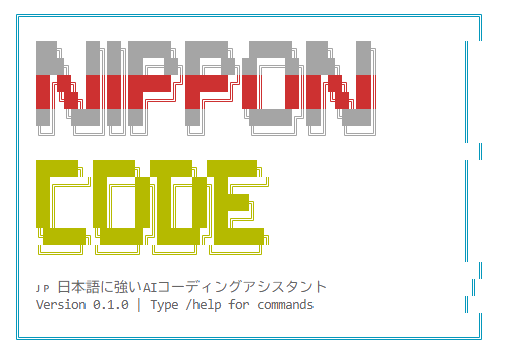

# 🌸 NipponCode



日本語対応のAIチャットツール（開発中）

[](https://www.npmjs.com/package/nippon-code)
[](https://opensource.org/licenses/MIT)

## ⚠️ 開発状況

**このプロジェクトは現在開発初期段階です。**
- ✅ 基本的なチャット機能のみ実装済み
- ✅ OpenAI公式SDK (v5.13.1) への移行完了 (2025-08-21)
- 🚧 その他の機能は開発中

## 概要

NipponCodeは、日本語での対話に最適化されたシンプルなAIチャットツールです。OpenAIやAnthropicのAPIを使用して、ターミナル上で対話を行うことができます。

### 現在できること

- 💬 **AIとの対話** - OpenAI/AnthropicのAPIを使用したテキストチャット
- 🎌 **日本語対応** - 日本語での自然な会話
- ⚙️ **API設定** - 複数プロバイダーとモデルの設定
- 📁 **基本的な分析** - プロジェクト構造の表示（実験的）
- 🔄 **セッション管理** - 会話の保存と再開

### 制限事項（今後改善予定）

- ⚠️ コード生成・編集はチャット応答のみ（ファイル編集不可）
- ⚠️ プロジェクト分析は基本的な構造表示のみ
- ⚠️ ファイルの直接操作は未対応
- ⚠️ リファクタリング自動化は未実装
- ⚠️ 高度なコンテキスト管理は開発中
- ⚠️ ユニットテストが未実装

## インストール

### 前提条件

- Node.js 18以上
- OpenAIまたはAnthropicのAPIキー

### npxで直接実行（推奨）
```bash
npx nipponcode init
npx nipponcode chat
```

### グローバルインストール
```bash
npm install -g nipponcode
nipponcode init  # または ncode init
nipponcode chat  # または ncode chat
```

### ローカル開発
```bash
# リポジトリをクローン
git clone https://github.com/nipponcode/nipponcode.git
cd nipponcode

# 依存関係をインストール
npm install

# ビルド
npm run build

# グローバルにリンク
npm link
```

## 使い方

### 1. 初期設定

```bash
nipponcode init  # または ncode init
```

設定ウィザードが起動し、以下を設定できます：
- APIキー（OpenAI、Anthropic、カスタム）
- APIベースURL（カスタムエンドポイント対応）
- 使用モデル（gpt-4、claude-3、gpt-oss等）
- 使用言語（日本語/英語）

環境変数での設定も可能：
```bash
# .envファイルを作成
cp env.example .env

# APIキーを設定
OPENAI_API_KEY=your-api-key-here
# または
ANTHROPIC_API_KEY=your-api-key-here
```

### 2. チャットを開始

```bash
nipponcode chat  # または ncode chat
nipponcode c     # ショートエイリアス

# オプション付き実行
nipponcode chat -m "こんにちは"  # 単発メッセージ
nipponcode chat -f file.txt       # ファイルコンテキスト付き
nipponcode chat --session dev     # セッション名指定
nipponcode chat --resume           # 前回のセッション再開
```

### 3. プロジェクト分析（実験的機能）

```bash
nipponcode analyze           # 現在のディレクトリを分析
nipponcode analyze src/      # 特定のパスを分析
nipponcode a --structure     # プロジェクト構造を表示
```

### 4. 設定管理

```bash
nipponcode config --list              # 設定を表示
nipponcode config --set model=gpt-4   # モデルを変更
nipponcode config --get model         # 現在のモデルを確認
```

## 設定ファイル

`.nipponcode/config.json`:
```json
{
  "provider": "openai",
  "model": "gpt-3.5-turbo",
  "apiKey": "your-api-key",
  "language": "ja"
}
```

## プロジェクト構造

```
src/
├── agents/          # チャットエージェント
│   ├── chat.ts      # メインチャットロジック
│   └── simple-chat.ts
├── commands/        # CLIコマンド
│   ├── chat.ts      # チャットコマンド
│   ├── config.ts    # 設定コマンド
│   └── init.ts      # 初期化コマンド
├── providers/       # AIプロバイダー
│   ├── openai.ts    # OpenAI統合（公式SDK v5.13.1使用）
│   └── base.ts      # ベースクラス
├── session/         # セッション管理
├── utils/           # ユーティリティ
└── cli.ts          # エントリーポイント
```

## 開発

### 開発モードで実行

```bash
npm run dev
```

### テスト（未実装）

```bash
npm test  # テストは今後実装予定
```

### ビルド

```bash
npm run build
```

## 最近の更新

### 2025-08-21
- ✅ **OpenAI API呼び出し部を公式SDKへ移行** ([PR #3](https://github.com/hokar3361/nippon-code/pull/3))
  - axiosからOpenAI公式SDK (v5.13.1)への移行
  - 自動リトライ機能（2回）の追加
  - エラーハンドリングの改善（OpenAI.APIError型の活用）
  - コードの重複を削減（リファクタリング）

## 今後の開発予定

### フェーズ1（現在）
- ✅ 基本的なチャット機能
- ✅ OpenAI/Anthropic API統合
- ✅ OpenAI公式SDKへの移行（2025-08-21完了）
- ⬜ ユニットテストの実装
- ⬜ エラーハンドリングの改善
- ⬜ セッション保存機能の強化

### フェーズ2
- ⬜ マルチターン会話の改善
- ⬜ コンテキスト管理
- ⬜ プロンプトテンプレート

### フェーズ3
- ⬜ ファイル読み込み機能
- ⬜ 簡単なコード提案

### 将来的な構想
- ⬜ VSCode拡張機能
- ⬜ Web UI
- ⬜ ローカルモデル対応

## トラブルシューティング

### APIキーエラー
- `.env`ファイルにAPIキーが正しく設定されているか確認
- APIキーの有効性を確認

### 接続エラー
- インターネット接続を確認
- ファイアウォール設定を確認

## コントリビューション

このプロジェクトは開発初期段階のため、フィードバックや提案を歓迎します！

1. Issueで機能提案やバグ報告
2. プルリクエストは`develop`ブランチへ
3. コミットメッセージは日本語OK

## ライセンス

MIT License - 詳細は[LICENSE](LICENSE)ファイルを参照

## 既知の課題

### 技術的負債
- ユニットテストが未実装
- エラーハンドリングが不完全（APIエラー時のリトライ機能はSDKで対応済み）
- TypeScriptの型定義で一部any型を使用
- セッション管理の同時アクセス処理が未実装

### 開発上の課題
- Anthropic APIの統合が未完了
- コード生成・編集機能が未実装
- プロジェクト分析機能が基本的な実装のみ

## 注意事項

- **本プロジェクトはまだ実験的な段階です**
- **プロダクション環境での使用は推奨しません**
- **コーディング支援機能は未実装です**
- **現時点では単純なチャットボットとしてのみ機能します**

## お問い合わせ

- 🐛 Issues: [GitHub Issues](https://github.com/nipponcode/nipponcode/issues)

---

開発中のプロジェクトです。ご理解とご協力をお願いします。 🚧