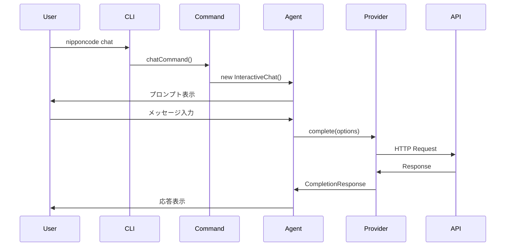

# NipponCode アーキテクチャドキュメント

## 1. システム概要

NipponCodeは、日本語対応のAIチャットツールとして設計されています。TypeScriptで実装され、モジュール化されたアーキテクチャを採用しています。

## 2. アーキテクチャ概要

### 2.1 レイヤー構造

```
┌─────────────────────────────────────────────┐
│           CLI Layer (cli.ts)                │
├─────────────────────────────────────────────┤
│         Command Layer (commands/)           │
├─────────────────────────────────────────────┤
│     Agent Layer        │   Session Layer    │
│      (agents/)         │    (session/)      │
├────────────────────────┴────────────────────┤
│         Provider Layer (providers/)         │
├─────────────────────────────────────────────┤
│  Config Layer   │   Utils Layer   │Analyzer │
│   (config/)     │    (utils/)     │         │
└─────────────────────────────────────────────┘
```

### 2.2 主要コンポーネント

#### 2.2.1 CLI層 (`cli.ts`)
- **責務**: コマンドラインインターフェースのエントリーポイント
- **機能**: 
  - コマンドのパース（Commander.js使用）
  - コマンドのルーティング
  - エラーハンドリング
  - ヘルプ表示

#### 2.2.2 Command層 (`commands/`)
- **責務**: 各コマンドの実装
- **コマンド一覧**:
  - `init.ts`: プロジェクト初期化
  - `chat.ts`: チャット機能のエントリーポイント
  - `interactive-chat.ts`: 対話型チャットの実装
  - `analyze.ts`: プロジェクト分析
  - `config.ts`: 設定管理

#### 2.2.3 Agent層 (`agents/`)
- **責務**: AIとの対話ロジック
- **主要クラス**:
  - `ChatAgent`: メインチャットエージェント
  - `SimpleChat`: シンプルなチャット実装
- **機能**:
  - メッセージ履歴管理
  - コンテキスト管理
  - トークン数管理
  - ストリーミング対応

#### 2.2.4 Provider層 (`providers/`)
- **責務**: AI APIプロバイダーの抽象化
- **設計パターン**: Strategy Pattern
- **実装**:
  - `base.ts`: 抽象基底クラス (`AIProvider`)
  - `openai.ts`: OpenAI API実装
  - `index.ts`: ファクトリー実装
- **サポート機能**:
  - 通常/ストリーミング応答
  - トークン推定
  - モデル管理

#### 2.2.5 Session層 (`session/`)
- **責務**: セッション管理
- **機能**:
  - セッションの永続化
  - 履歴管理
  - セッション再開

#### 2.2.6 Config層 (`config/`)
- **責務**: 設定管理
- **設計パターン**: Singleton Pattern
- **機能**:
  - 環境変数からの読み込み
  - グローバル/ローカル設定ファイル
  - 設定の検証
  - デフォルト値管理

#### 2.2.7 Utils層 (`utils/`)
- **責務**: 共通ユーティリティ
- **機能**:
  - ファイル操作 (`files.ts`)
  - 環境セットアップ (`setup.ts`)
  - ASCIIアート表示 (`ascii-art.ts`)

#### 2.2.8 Analyzer層 (`analyzers/`)
- **責務**: プロジェクト分析
- **機能**:
  - ディレクトリ構造分析
  - 依存関係分析
  - コード複雑度計算

## 3. データフロー

### 3.1 チャット処理フロー



### 3.2 設定読み込みフロー

```
1. デフォルト設定の読み込み
2. 環境変数からのオーバーライド (.env)
3. グローバル設定ファイル (~/.nipponcode/config.json)
4. ローカル設定ファイル (./.nipponcode/config.json)
```

優先順位: ローカル > グローバル > 環境変数 > デフォルト

## 4. 主要インターフェース

### 4.1 Message インターフェース
```typescript
interface Message {
  role: 'system' | 'user' | 'assistant';
  content: string;
}
```

### 4.2 Context インターフェース
```typescript
interface Context {
  type: 'file' | 'directory' | 'code' | 'system';
  path?: string;
  name?: string;
  content: string;
}
```

### 4.3 Session インターフェース
```typescript
interface Session {
  id: string;
  name: string;
  messages: Message[];
  contexts: Context[];
  metadata: {
    createdAt: Date;
    updatedAt: Date;
    model?: string;
    totalTokens?: number;
  };
}
```

## 5. 設計原則

### 5.1 SOLID原則の適用
- **単一責任の原則**: 各クラスは明確に定義された単一の責務を持つ
- **開放閉鎖の原則**: Providerの追加が容易（拡張に開放、修正に閉鎖）
- **依存性逆転の原則**: 抽象クラス(AIProvider)に依存

### 5.2 デザインパターン
- **Singleton Pattern**: ConfigManager
- **Strategy Pattern**: AIProvider
- **Factory Pattern**: ProviderFactory
- **Builder Pattern**: メッセージ構築（buildMessages）

### 5.3 非同期処理
- Promise/async-awaitパターンの一貫した使用
- ストリーミング応答のためのAsyncGenerator使用

## 6. セキュリティ考慮事項

### 6.1 APIキー管理
- 環境変数での管理推奨
- 設定ファイルに保存する場合は.gitignoreで除外
- 表示時はマスキング（末尾4文字のみ表示）

### 6.2 入力検証
- 設定値の検証（ConfigManager.validate()）
- APIレスポンスの検証

## 7. パフォーマンス最適化

### 7.1 トークン管理
- メッセージ履歴の自動トリミング
- トークン数の事前推定（tiktoken使用）
- モデル固有の最大トークン数管理

### 7.2 ストリーミング
- リアルタイム応答のためのストリーミング対応
- Server-Sent Events (SSE)のパース

## 8. 拡張性

### 8.1 新プロバイダーの追加
1. `AIProvider`抽象クラスを継承
2. 必須メソッドの実装
3. ProviderFactoryに登録

### 8.2 新コマンドの追加
1. `commands/`ディレクトリに新ファイル作成
2. `cli.ts`にコマンド登録

## 9. 今後の拡張予定

### フェーズ2
- マルチターン会話の改善
- コンテキスト管理の強化
- プロンプトテンプレート機能

### フェーズ3
- ファイル読み込み機能
- コード提案機能
- VSCode拡張機能

## 10. ディレクトリ構造

```
src/
├── agents/          # チャットエージェント
│   ├── chat.ts      # メインチャットロジック
│   └── simple-chat.ts
├── analyzers/       # プロジェクト分析
│   └── project.ts
├── commands/        # CLIコマンド
│   ├── analyze.ts
│   ├── chat.ts
│   ├── config.ts
│   ├── init.ts
│   └── interactive-chat.ts
├── config/          # 設定管理
│   └── index.ts
├── providers/       # AIプロバイダー
│   ├── base.ts      # 抽象基底クラス
│   ├── index.ts     # ファクトリー
│   └── openai.ts    # OpenAI実装
├── session/         # セッション管理
│   ├── manager.ts
│   └── simple-manager.ts
├── utils/           # ユーティリティ
│   ├── ascii-art.ts
│   ├── files.ts
│   └── setup.ts
├── cli.ts           # エントリーポイント
└── setup.ts         # 初期設定
```

---
更新日: 2025-08-20
バージョン: 0.1.0