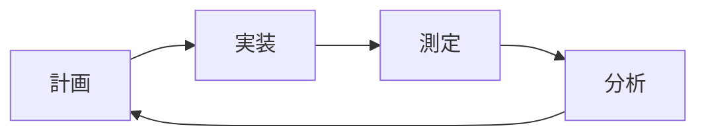

# NipponCode 開発ロードマップと課題管理

## 1. 現在の課題

### 1.1 緊急対応が必要な課題

#### 🔴 P0: クリティカル
- なし（現時点で動作を阻害する問題はない）

#### 🟠 P1: 高優先度
1. **エラーハンドリングの強化**
   - API失敗時のリトライ機構実装
   - ネットワークエラーの適切な処理
   - ユーザーフレンドリーなエラーメッセージ

2. **テストの実装**
   - 単体テストの作成
   - 統合テストの作成
   - CI/CDパイプラインの構築

3. **Anthropic API統合**
   - ClaudeモデルのサポートDEPC

### 1.2 改善が望ましい課題

#### 🟡 P2: 中優先度
1. **コード品質**
   - TypeScript型定義の強化（any型の排除）
   - コード重複の解消
   - リファクタリング

2. **ドキュメント**
   - APIドキュメントの作成
   - 開発者向けガイド
   - ユーザーマニュアル

3. **セッション管理の改善**
   - セッションの圧縮
   - 自動クリーンアップ
   - セッション検索機能

#### 🟢 P3: 低優先度
1. **ロギング機能**
   - 構造化ログの実装
   - ログレベル管理
   - ログローテーション

2. **国際化（i18n）**
   - メッセージの外部化
   - 多言語サポート

## 2. 開発ロードマップ

### Phase 1: 基盤強化（1-2ヶ月）
**目標**: 安定性と信頼性の向上

- [ ] エラーハンドリングの全面改善
- [ ] 基本的な単体テストの実装（カバレッジ60%以上）
- [ ] CI/CDパイプラインの構築
- [ ] Anthropic API統合
- [ ] ドキュメントの整備

**成果物**:
- エラーリカバリー機能
- テストスイート
- CI/CD環境
- 完全なAPIドキュメント

### Phase 2: 機能拡張（2-3ヶ月）
**目標**: コーディング支援機能の実装

- [ ] ファイル読み込み/編集機能
- [ ] コード生成機能
- [ ] プロジェクト分析機能の統合
- [ ] コンテキスト管理の改善
- [ ] プロンプトテンプレート機能

**成果物**:
- ファイル操作API
- コード生成エンジン
- プロジェクト分析レポート
- テンプレートライブラリ

### Phase 3: UX改善（2-3ヶ月）
**目標**: ユーザー体験の向上

- [ ] Web UIの開発
- [ ] VSCode拡張機能
- [ ] リアルタイムコラボレーション
- [ ] プラグインシステム
- [ ] パフォーマンス最適化

**成果物**:
- Webダッシュボード
- VSCode Extension
- プラグインAPI
- パフォーマンスベンチマーク

### Phase 4: エンタープライズ対応（3-4ヶ月）
**目標**: 企業利用への対応

- [ ] ローカルLLMサポート
- [ ] セキュリティ強化
- [ ] 監査ログ
- [ ] RBAC（役割ベースアクセス制御）
- [ ] エンタープライズSSO統合

**成果物**:
- オンプレミス版
- セキュリティ認証
- 企業向けドキュメント

## 3. 技術的改善提案

### 3.1 アーキテクチャレベル

#### Clean Architecture の採用
```
├── domain/          # ビジネスロジック
├── application/     # ユースケース
├── infrastructure/  # 外部サービス
└── presentation/    # UI層
```

**メリット**:
- テスタビリティの向上
- 依存関係の明確化
- 変更の影響範囲の限定

#### Event-Driven Architecture
```typescript
interface EventBus {
  emit(event: Event): void
  on(event: string, handler: Handler): void
}
```

**メリット**:
- プラグインシステムの実現
- 疎結合な設計
- 拡張性の向上

### 3.2 実装レベル

#### Dependency Injection の導入
```typescript
@Injectable()
class ChatService {
  constructor(
    private provider: AIProvider,
    private session: SessionManager
  ) {}
}
```

**メリット**:
- テストのモック化が容易
- 依存関係の管理
- 設定の柔軟性

#### Result型の導入
```typescript
type Result<T, E> = 
  | { ok: true; value: T }
  | { ok: false; error: E }
```

**メリット**:
- エラーハンドリングの型安全性
- 例外の削減
- 予測可能なエラー処理

### 3.3 開発プロセス

#### TDD（Test-Driven Development）
1. テストファースト開発
2. レッドグリーンリファクタリングサイクル
3. 継続的なテスト実行

#### ペアプログラミング/レビュー
1. PR必須化
2. コードレビューチェックリスト
3. 知識共有セッション

## 4. リスク管理

### 4.1 技術的リスク

| リスク | 影響度 | 発生確率 | 対策 |
|--------|--------|----------|------|
| API料金の増大 | 高 | 中 | レート制限、キャッシュ実装 |
| トークン制限超過 | 中 | 高 | 動的トリミング、警告表示 |
| プロバイダー依存 | 高 | 低 | 複数プロバイダー対応 |
| セキュリティ脆弱性 | 高 | 中 | セキュリティ監査、暗号化 |

### 4.2 プロジェクトリスク

| リスク | 影響度 | 発生確率 | 対策 |
|--------|--------|----------|------|
| スコープクリープ | 中 | 高 | 明確な要件定義、段階的リリース |
| 技術的負債の蓄積 | 高 | 中 | 定期的なリファクタリング |
| ドキュメント不足 | 中 | 高 | ドキュメント自動生成、レビュー |

## 5. 成功指標（KPI）

### 5.1 技術指標
- コードカバレッジ: 80%以上
- ビルド時間: 30秒以内
- 平均レスポンスタイム: 1秒以内
- エラー率: 1%以下

### 5.2 品質指標
- バグ密度: 1件/1000行以下
- 技術的負債比率: 5%以下
- コード複雑度: 10以下

### 5.3 ユーザー指標
- 日次アクティブユーザー（DAU）
- セッション継続時間
- ユーザー満足度（NPS）
- 機能利用率

## 6. 改善プロセス

### 6.1 継続的改善サイクル


### 6.2 フィードバックループ
1. **ユーザーフィードバック**
   - GitHubコース Issues
   - ユーザーサーベイ
   - 利用統計分析

2. **開発者フィードバック**
   - スプリントレトロスペクティブ
   - 技術的改善提案
   - ペアプロ/モブプロセッション

3. **自動フィードバック**
   - パフォーマンスモニタリング
   - エラー追跡
   - 利用分析

## 7. 次のアクション

### 即座に開始すべきタスク
1. エラーハンドリングの実装計画作成
2. テスト戦略の策定
3. CI/CD環境の調査と選定

### 今週中に完了すべきタスク
1. 優先度P1課題のタスク分解
2. Phase 1の詳細スケジュール作成
3. テスト環境のセットアップ

### 今月中に達成すべきマイルストーン
1. 基本的なエラーハンドリング実装
2. 最初の単体テスト作成
3. Anthropic APIプロバイダーの実装開始

## 8. リソース要件

### 8.1 人的リソース
- フルタイム開発者: 2-3名
- パートタイムレビュアー: 1-2名
- テスター/QA: 1名

### 8.2 技術的リソース
- CI/CDサービス（GitHub Actions等）
- テスト環境
- 監視ツール

### 8.3 予算
- API利用料金
- インフラストラクチャ費用
- ツール/サービス料金

---
更新日: 2025-08-20
バージョン: 0.1.0
ステータス: 計画中